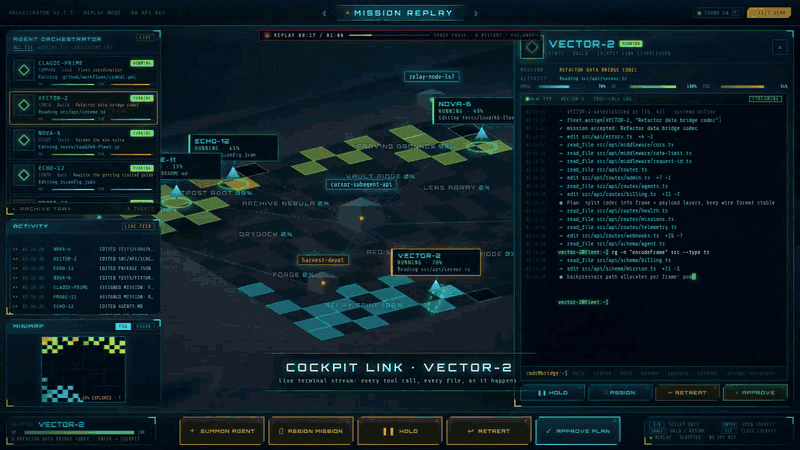
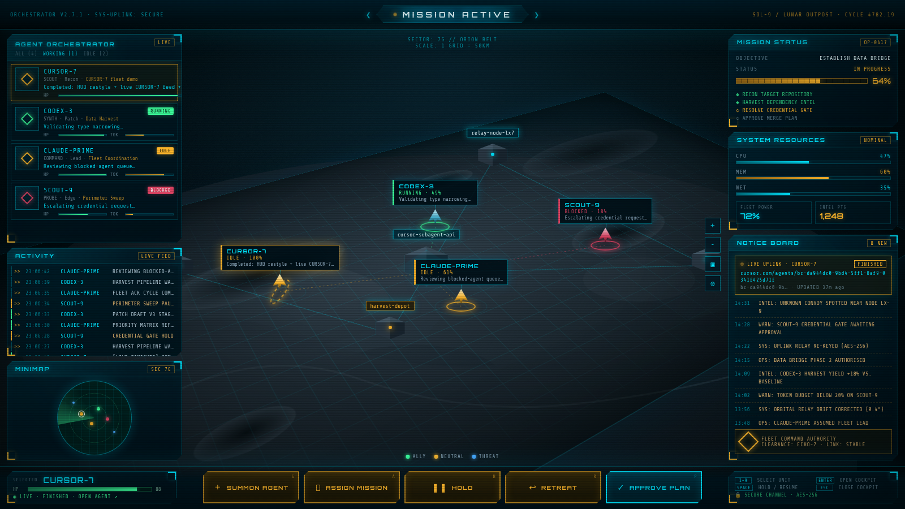
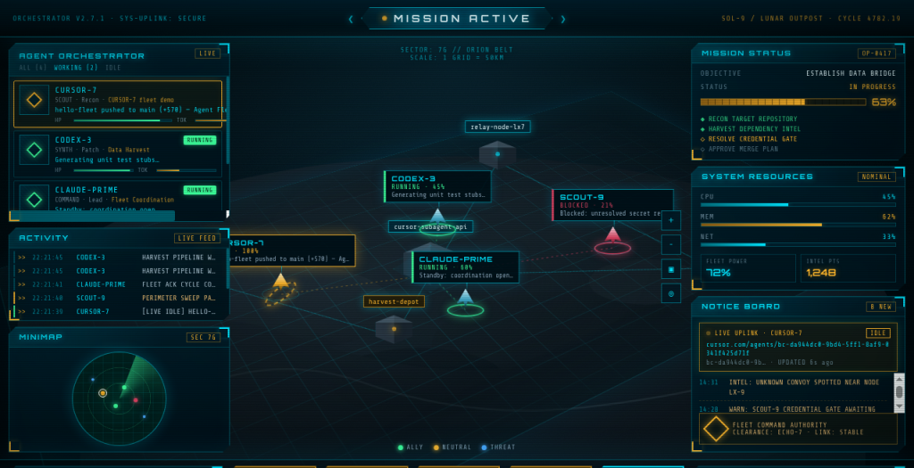
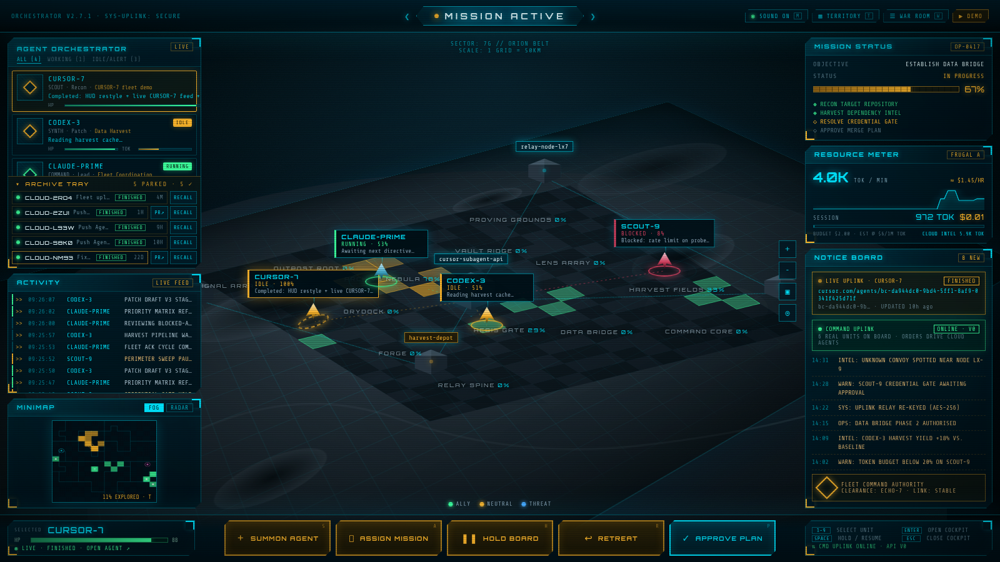
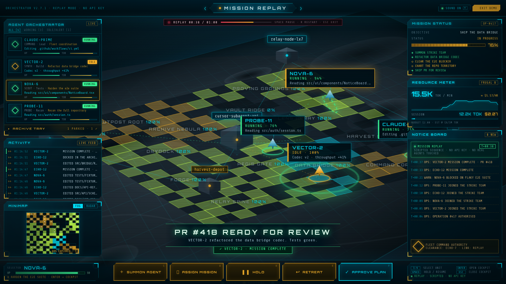
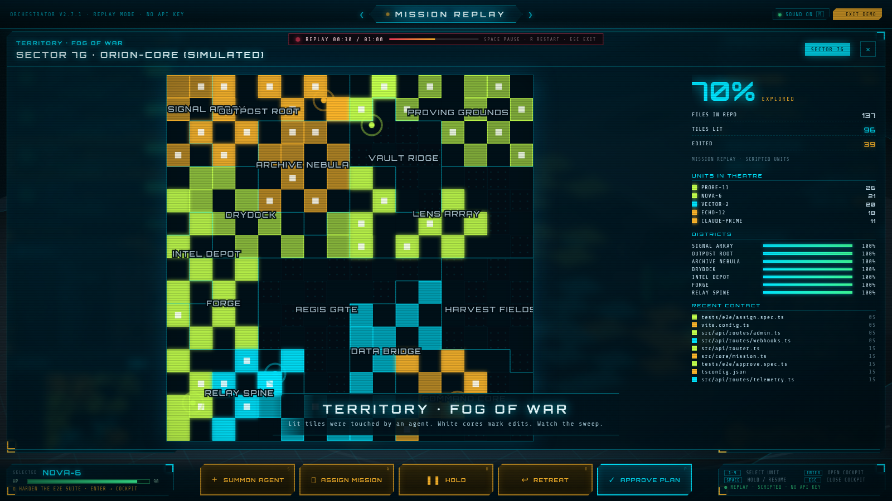
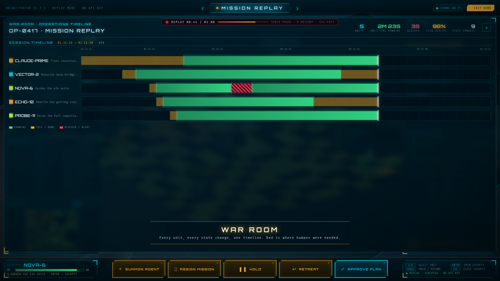
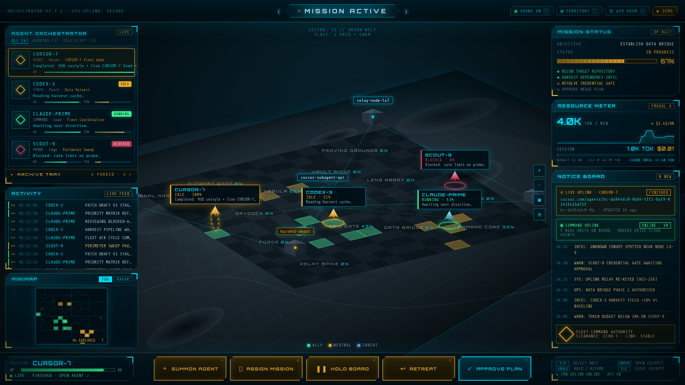
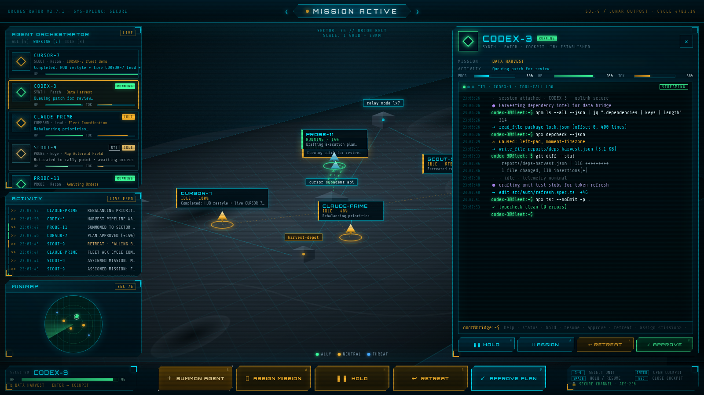
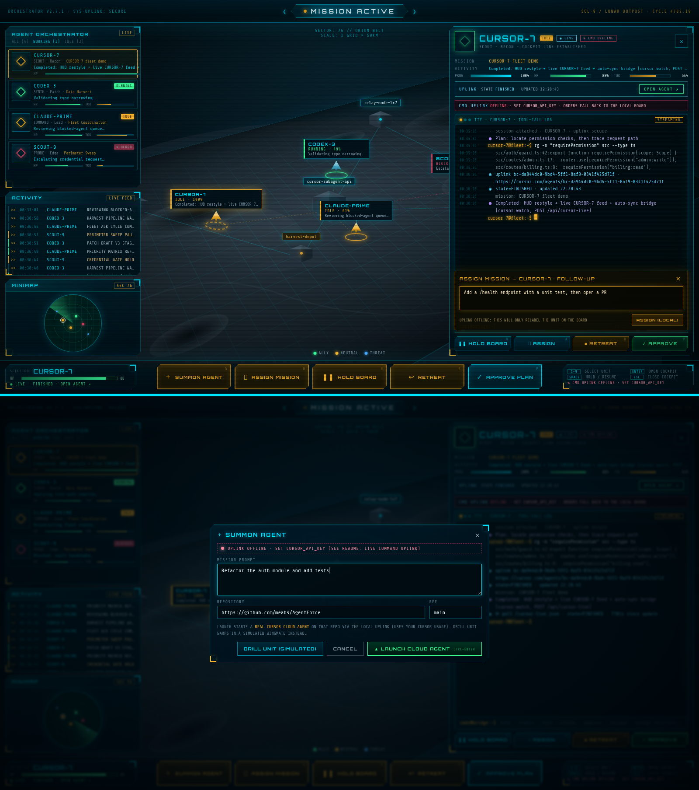

# ◆ AGENT FLEET COMMAND ◆

> **Your coding agents, deployed as a holographic strike fleet.** This is a real-time strategy command board for AI agents, with cyan/amber HUD, scanlines, radar sweep and all.

<p align="center">
  <a href="media/demo.mp4"></a>
</p>

<p align="center"><b>▶ <a href="media/demo.mp4">Watch the 60-second Mission Replay</a></b> (mp4, no audio). The GIF is a 16-second highlight reel; click it for the full take.</p>

> **Before you fly:** read the [SYSTEMS CHECK](#-systems-check-what-works-vs-what-is-untested). Some systems are combat-proven, some have only flown in the simulator, and we tell you which is which.



<sub>▲ **TACTICAL OVERVIEW.** Four units on station over Sector 7G. The roster is on the left, the sector map in the centre, mission telemetry on the right and the command bar at the bottom.</sub>



<sub>▲ **LIVE UPLINK ENGAGED.** CURSOR-7's status comes from `cursor-live.json`, a status file that mirrors a real cloud agent (pushed by a script, not fetched by the browser). The Notice Board shows the uplink and the activity feed logs `[LIVE IDLE]`.</sub>

---

## 🩺 SYSTEMS CHECK: WHAT WORKS VS WHAT IS UNTESTED

```
DIAGNOSTIC REPORT        CYCLE 4782.20 (2026-10-06)        SPIN: NONE

Commander, not every system aboard has seen combat. Here is the flight
engineer's checklist. GREEN has flown and been verified. AMBER has only
flown in the simulator (or has a known gap). Read it before you send
real orders.
```

| System | Status | Notes |
|---|---|---|
| Tactical HUD (roster, sector map, minimap, panels, command bar) | 🟢 Tested, working | |
| Simulated units (mock fleet) | 🟢 Tested, working | No key or network needed |
| Cockpit, streaming terminal and console | 🟢 Tested, working | |
| Keyboard shortcuts | 🟢 Tested, working | |
| Hosted Mission Replay demo (`https://meabs.github.io/AgentForce/`) | 🟢 Tested, working | Runs with no API key and supports desktop, tablet, and phone layouts. Checked with emulated iPhone 13 and Pixel 7 devices, plus desktop 1600×900. Not tested on a physical phone. |
| Fog of war map (Territory overlay, minimap FOG mode) | 🟢 Tested, working | Real-agent coverage is partial, see limits below |
| War Room timeline | 🟢 Tested, working | |
| Archive tray UI | 🟢 Tested, working | Board-only, saved in `localStorage` |
| Sound effects and voice lines | 🟡 Code runs, never heard | The WebAudio and SpeechSynthesis code executes, but nobody has listened to it yet. Headless capture had no audio, and the demo video is silent |
| `npm run build` | 🟢 Passes | |
| Live uplink: list real cloud agents (read-only) | 🟢 Verified on the real Cursor API | Verified on 2026-10-06: `GET /api/agents` answered 200 in about 0.5 s with real agents |
| Live uplink: per-agent status and transcript | 🟢 Verified on the real Cursor API | Verified on 2026-10-06 with a throwaway test agent: status polling saw CREATING → RUNNING → FINISHED, and the transcript returned every user and assistant message |
| SUMMON → LAUNCH CLOUD AGENT (launch) | 🟢 Verified on the real Cursor API | Verified on 2026-10-06: 201 in about 9 s, agent came back as CREATING with its id, URL and branch name. The bridge now sends `autoCreatePr: false`; the test agent pushed no branch and opened no PR |
| ASSIGN MISSION / APPROVE PLAN (follow-up) | 🟢 Verified on the real Cursor API | Verified on 2026-10-06: 200 in under 1 s on a FINISHED agent, the agent went back to RUNNING and replied. APPROVE PLAN uses the same follow-up route, so it is covered by the same test. Heads-up: the API keeps reporting the old FINISHED status for 2 to 8 s after a follow-up; the board now holds the unit at RUNNING through that gap (code fix, builds green, not yet watched live in the browser) |
| RETREAT (stop) | 🟢 Verified on the real Cursor API | Verified on 2026-10-06: stop on a RUNNING agent answered 200, the run ended about 6 s later without replying. v0 then reports the agent as FINISHED (not STOPPED). Stop on an already finished agent also answers 200 |
| v1 API mode (`CURSOR_API_VERSION=v1`) | 🟡 Fake server only | Endpoints implemented, tested against the fake server only. **v0 is the default** |

**Known limits of the hull:**

- **Fog of war on real agents** only charts files that are mentioned in the agents' summaries and transcripts. The full file tree of a public GitHub repo is fetched anonymously and may be rate limited; private repos always use mentioned files only.
- **Token and cost meter** figures are illustrative estimates, not real billing data.
- **The command uplink needs a server.** The bridge only exists under `npm run dev` or `npm run preview`. Static builds are replay-only (`dist-demo/`), and a `dist/` folder on a static host has no uplink.
- **HOLD only freezes the board.** The Cursor API has no pause, so a held cloud agent keeps running (and spending) in the cloud.
- **Real orders cost real usage.** Launches and follow-ups spend Cursor credits. The v0 write paths have now flown against the real API (see the live sortie log below), but a summoned unit is a real agent with write access to the repo you point it at.
- **Status lags behind orders.** After a follow-up or a stop the API takes a few seconds to report the new state. The board covers the follow-up gap; after RETREAT expect RUNNING for up to about 6 s before FINISHED.

**Live sortie log (2026-10-06, v0, real Cursor API, throwaway agent on `meabs/AgentForce@main`):**

| Order (bridge route) | Result |
|---|---|
| `GET /api/agents` | 200, real roster returned. Cross-origin POST refused with 403, non-JSON POST refused with 415 |
| `POST /api/agents` (SUMMON) | 201 in 9.3 s, status CREATING. Polling: RUNNING, then FINISHED, about 26 s after creation. Reply: "Unit ready." |
| `GET /api/agents/:id/conversation` | 200 in 0.3 s, user prompt and assistant reply returned |
| `POST /api/agents/:id/followup` (ASSIGN / APPROVE) | 200 in 0.9 s. Status stayed FINISHED for about 1 to 8 s, then RUNNING, then FINISHED. Reply: "Orders received." |
| `POST /api/agents/:id/stop` (RETREAT) | Sent about 4 s after a deliberately long run showed RUNNING: 200 in 0.3 s, RUNNING for about 6 s more, then FINISHED with no reply |
| Bad id / unknown id | 400 `BAD_ID` / 404 `UPSTREAM_404` |
| Cleanup | Test agent stopped, then permanently deleted through the API (it lingers in the v0 list as EXPIRED). No branch and no PR appeared on GitHub |



<sub>▲ **LIVE SORTIE.** The throwaway "Fleet uplink test" agent, docked in the archive tray as FINISHED after its live run.</sub>

---

## 🌅 OVERNIGHT UPGRADE: SHIP'S LOG, CYCLE 4782.20

```
PRIORITY: ALPHA          FROM: NIGHT WATCH          TO: COMMANDER

While you slept, the shipwrights went to work. The bridge now talks back,
the map has fog, the fleet can fly itself for the cameras, and finished
units park themselves in a tidy hangar. Coffee first. Then press DEMO.
```



<sub>▲ **MISSION REPLAY.** The scripted 60 second sequence, mid-flight. VECTOR-2 has just shipped PR #418; the camera follows the action and the captions narrate it.</sub>

### 🎬 MISSION REPLAY (the "press record" button)

A self-running 60 second cinematic: units are summoned, given orders, one gets blocked and needs a commander's call, fog lifts across the repo, units finish with fanfares and dock in the archive, the War Room replays the whole operation, and an after-action report rolls the credits. No API key, no network, no real agents touched.

| How | What happens |
|---|---|
| Click **▶ DEMO** (top right) | Switches to the replay. **■ EXIT DEMO** or `Esc` comes back to the live HUD |
| Open **`/?demo=1`** | Straight into the replay. A title card counts down from 5, or click **ENGAGE** to start with sound |
| **`/?demo=1&loop=1`** | Loops forever (kiosk, booth, background B-roll) |
| **`/?demo=1&autostart=0`** | Waits on the title card until you click ENGAGE (best for screen recording) |
| `Space` / `R` / `M` | Pause, restart, mute |

The replay has camera pans and zooms, a virtual commander cursor that "clicks" the real command bar buttons, lower-third captions, a REC progress strip and letterboxed title and end cards. It is deterministic (seeded), so every take matches.

**For YouTube:** open `/?demo=1&autostart=0` full screen at 1600×900 or larger, start OBS, click ENGAGE. The browser has to hear one click before it is allowed to play audio, which is exactly what ENGAGE is for. Audio heads-up: the sound has not been checked by ear yet (see [SYSTEMS CHECK](#-systems-check-what-works-vs-what-is-untested)), so do a test listen before you hit record.

**Static hosting:** `npm run build:demo` writes a demo-only bundle to `dist-demo/` (always in replay mode, loops by default, no bridge, no live HUD, and the live status file is stripped). Drop that folder on any static host.

### 🔊 SHIP'S AUDIO: SYNTHESIZED, NOT SAMPLED

Every sound is generated live with WebAudio oscillators, filters and noise. There are no audio files in the repo. Honest caveat: the synth code runs, but so far it has only been exercised headlessly with no speakers attached, so nobody has actually heard these sounds yet. Treat the table below as the design spec until a human ear signs off.

| Event | Sound | Voice line |
|---|---|---|
| Select a unit | two-pip blip | |
| Orders, approve, resume | rising three-note chirp | "Orders received." / "Plan approved. Proceeding." |
| Hold / retreat | descending pips / falling sweep | "Holding position." / "Falling back." |
| Summon, launch | warp whoosh + sparkle | "Vector 2. Unit ready." |
| A unit finishes | original brass-style fanfare | "Mission complete." |
| A unit goes BLOCKED or errors | two-tone klaxon | "Alert. Unit requires attention." |
| Failed order | low buzz | |

Voice lines use your browser's built-in SpeechSynthesis voice, pitched down for that ship's computer feel (a short radio squelch plays first). Sound is **on by default**; the **SOUND ON / OFF** toggle (or `M`) is remembered in `localStorage`. Fanfares and klaxons are wired to fire on real cloud agents' state changes (and on every beat of the replay); the simulated wingmates stay quiet so the board doesn't turn into a pinball machine.

### 🌫 FOG OF WAR: THE REPO IS THE MAP



<sub>▲ **TERRITORY.** Every tile is a file. Files are sorted by path and laid out along a Hilbert curve, so each directory becomes a contiguous district. Tiles light up in the colour of the agent that touched them, fade from hot to explored, and get a white core when the file was edited.</sub>

- **On the tactical map:** the isometric ground plane is now a fog-of-war grid with district names (AEGIS GATE is `src/auth`, PROVING GROUNDS is `tests`, and so on). Simulated units patrol their home districts and visibly fly to the file they are working on.
- **Minimap:** `FOG` mode (default) shows the same territory top-down with an explored percentage. `RADAR` brings the old sweep back. Click it to open the full map.
- **TERRITORY overlay (`T`):** big map, hover any tile for its path, who touched it and how hot it is, plus explored %, per-unit counts, district progress and recent contact.
- **Real data:** for real cloud agents the board reads each agent's summary and transcript (read-only GETs through the local bridge), pulls out every file path mentioned, and charts a territory per repo (one tab each). For public GitHub repos it also tries to fetch the full file tree anonymously, so you get true fog with only the touched files lit. Private repos or a rate-limited GitHub fall back to "charted" mode: only the files the agents named. Either way, expect a partial map for real agents: a file only lights up if an agent mentioned it. Simulated units light tiles from the file paths in their own terminal output plus their patrols.

### 🗄 ARCHIVE TRAY + INSTANT LAUNCH

- Finished cloud agents (`FINISHED`, `EXPIRED`, `CANCELLED`, ...) no longer clutter the roster. Ones that finished before you opened the board dock straight away; ones that finish while you watch get a fanfare, a victory lap of about 45 seconds, then slide down into the **ARCHIVE TRAY** at the bottom of the roster.
- Open the tray to see each parked unit's status, age and PR link. Click a card to open its cockpit, **RECALL** to put it back on the roster. Any unit can be parked by hand with **⇣ ARCHIVE** in its cockpit. It is all board-only (saved in `localStorage`); nothing is sent to the agent.
- **Instant RUNNING:** pressing LAUNCH now closes the dialog straight away and warps in a RUNNING placeholder (`CLOUD-····`) while the API call is in flight. It becomes the real unit the moment the agent id comes back, or turns red with the error (and a klaxon) if the launch fails. Your prompt is kept for the retry. (LAUNCH was verified against the real Cursor API on 2026-10-06.)
- The roster tabs (ALL / WORKING / IDLE+ALERT) now actually filter.

### ☰ WAR ROOM (`W`)



<sub>▲ **WAR ROOM.** Every unit's RUNNING / IDLE / BLOCKED history on one timeline, with flow health and blocked time up top. Red stripes are where a human was needed.</sub>

The live War Room adds a **CLOUD RUN LOG** of your real cloud agents on a log-scaled age axis (the last hour gets as much room as the last month), with status and PR links. Click any lane to jump to that unit's cockpit.

### 💸 RESOURCE METER: A FRUGAL RATING

The old CPU/MEM panel is now a token burn meter: tokens per minute with a sparkline, a session total and estimated cost against a $2 frugal budget, and a **FRUGAL** grade (A+ to D) based on projected spend per running unit per hour. When the uplink is online it also shows an estimate of the tokens in your real agents' transcripts (characters divided by 4). All figures are clearly labelled estimates: the simulated rates are illustrative, and pricing uses a blended $6 per million tokens. None of it is real billing data, so check your Cursor dashboard for actual spend.

### ⌨ NEW KEYS

| Key | Action |
|---|---|
| `T` | Territory (fog of war) overlay |
| `W` | War Room timeline |
| `M` | Mute / unmute sound and voice |
| `Esc` | Close the overlay (or exit the replay) |



<sub>▲ **LIVE HUD, UPGRADED.** Fog on the map, the archive tray under the roster, the frugal resource meter and the new toolbar (SOUND, TERRITORY, WAR ROOM, DEMO).</sub>

---

## ▶ INCOMING TRANSMISSION

```
PRIORITY: ALPHA          CLEARANCE: ECHO-7          CHANNEL: SECURE

Commander,

Four agents are deployed across Sector 7G. One of them, CURSOR-7,
mirrors a real cloud agent through a status-file uplink. The others are
simulated wingmates running drills to keep the board alive.

Your orders: launch the board, watch the feed, keep the fleet unblocked.

                                        · FLEET COMMAND AUTHORITY
```

## ⚡ LAUNCH SEQUENCE

```bash
git clone https://github.com/meabs/AgentForce.git
cd AgentForce
npm install
cp .env.example .env.local   # optional: only needed for the live command uplink
npm run dev
```

`.env.local` is where your `CURSOR_API_KEY` goes if you arm the uplink (see [Arm the uplink](#arm-the-uplink)). Leave it empty to fly with simulated units only. It is gitignored; never commit it.

Open the URL Vite prints, usually **http://localhost:5173**. Best viewed at **1280×720 or larger**; the screenshots were captured at 1600×900.

No API keys needed to fly. Everything runs locally unless you arm the optional [LIVE COMMAND UPLINK](#-live-command-uplink) with a Cursor API key. The only other external request is to Google Fonts for Orbitron and Share Tech Mono, and the board falls back to system fonts if you're offline.

## 🛰 WHAT YOU'RE LOOKING AT

An RTS-style agent management board in the AgentCraft mould (roster top-left, minimap bottom-left, mission banner top-centre, map everywhere else), restyled as a space-opera holographic HUD.

| Station | Where | What it does |
|---|---|---|
| **Mission Banner** | Top | `MISSION ACTIVE` chevron, orchestrator / uplink readout, sector and cycle |
| **Agent Orchestrator** | Left | Roster cards with RUNNING / IDLE / BLOCKED pills, class, role, mission, live activity, HP and token bars |
| **Activity** | Left, under roster | `>>` timestamped live log that ticks every ~2.6s |
| **Minimap** | Bottom-left | Circular radar with a rotating sweep and unit blips |
| **Tactical Map** | Everywhere else | Perspective terrain with craters and a cyan grid, block structures with blinking lights, animated data links, ships with selection rings and floating labels, a legend and map tool buttons |
| **Mission Status** | Right | Objective, an amber progress bar starting at 62% and an objectives checklist |
| **System Resources** | Right | Fluctuating CPU / MEM / NET bars, fleet power and intel points |
| **Notice Board** | Right | Live uplink card, alerts and the authority badge |
| **Command Bar** | Bottom | Selected unit box (click to open the cockpit) and **SUMMON AGENT · ASSIGN MISSION · HOLD/RESUME · RETREAT · APPROVE PLAN** |

**Controls:** click a roster card, a map ship or its floating label to open that unit's **cockpit** (details in the next section). Press `1` to `9` to select a unit; if a cockpit is open, it switches to that unit. The command bar buttons act on the **selected** unit.

Over all of it sits a CRT scanline layer with a faint flicker, plus notched panels with cyan/amber corner brackets.

### The fleet

| Unit | Mission | Disposition |
|---|---|---|
| **CURSOR-7** | Mirrors a real cloud agent (see below) | Whatever the uplink says |
| **CODEX-3** | Data Harvest | Simulated: RUNNING / IDLE |
| **CLAUDE-PRIME** | Fleet Coordination | Simulated: IDLE / RUNNING |
| **SCOUT-9** | Perimeter Sweep | Simulated: mostly BLOCKED until you **APPROVE PLAN** |

The simulated units cycle activity lines and status via `src/hooks/useActivityTicker.ts`. Their data lives in `src/data/mockAgents.ts`.

## 🎮 COCKPIT: TAKE THE STICK



<sub>▲ **COCKPIT ONLINE.** One click on a unit and its flight deck slides in: stats up top, a streaming terminal in the middle, orders at your fingertips.</sub>

```
MISSION BRIEFING: COCKPIT ACCESS       CLEARANCE: ECHO-7

Commander,

Watching from orbit is no longer enough. Each unit now has a cockpit.
Climb in, read its terminal as it streams, and issue orders directly:
HOLD it, RESUME it, ASSIGN a new mission, call a RETREAT, APPROVE the
plan, or SUMMON reinforcements. Your hands never need to leave the keys.

Fly safe. The fleet is listening.

                                        FLEET COMMAND AUTHORITY
```

Select any unit to open its cockpit, which slides in from the right. It shows:
- The unit's name, status pill, HOLD/RTB and LIVE badges, mission, current activity, and progress / HP / token bars.
- A **live terminal**: a streaming tool-call log. Lines type themselves out, prompts are coloured by status (green RUNNING, amber IDLE, red BLOCKED, grey HOLD), and the view auto-scrolls. Scroll up to read history, then press **▼ LIVE** to jump back. Mock units replay plausible transcripts (`rg`, `read_file`, `edit`, `vitest`, `vault read`…). CURSOR-7 instead streams real **uplink lines** from `cursor-live.json` (state, mission, summary, poll heartbeat), and the cockpit shows an **OPEN AGENT ↗** button.
- A **console input** (`cmdr@bridge:~$`) with ↑/↓ history. Commands: `help`, `status`, `hold`, `resume`, `approve`, `retreat`, `assign <mission>`, `clear`. Anything else gets a simulated reply from mock units. On real units, free text is sent to the cloud agent as a follow-up when the uplink is armed (otherwise the console tells you to set `CURSOR_API_KEY`).

| Order | Effect (in-demo) | Key |
|---|---|---|
| **HOLD / RESUME** | Freezes that unit's simulated ticker: activity, status, position, feed lines and terminal all pause. RESUME re-engages it. | `H` / `Space` |
| **ASSIGN MISSION** | Opens a quick-pick of 9 missions plus a custom field, and updates the mission on the card, map label and cockpit | `A` |
| **RETREAT** | Parks the unit at the rally point: status → IDLE, RTB badge, ticker paused, warning log line. RESUME redeploys it. | `R` |
| **APPROVE PLAN** | ACK toast, green log line, unit progress +15% and mission progress +3%. A BLOCKED unit gets unblocked and moves to RUNNING. | `P` |
| **SUMMON AGENT** | Opens the Summon dialog. **DRILL UNIT** warps in a new mock unit (PROBE-11, VECTOR-2, RELAY-4…); **LAUNCH CLOUD AGENT** starts a real one via the [uplink](#-live-command-uplink). Either way the new unit is selected and its cockpit opens. | `S` |
| **Open / close** | `Enter` opens the selected unit's cockpit. `Esc` closes the mission picker first, then the cockpit. ✕ also closes it. | `Enter` / `Esc` |

Every order adds a line to the unit's terminal and to the activity feed. On simulated units all orders are **local to the board**. On real units (CURSOR-7 and any `CLOUD-xxxx` unit) ASSIGN, APPROVE, RETREAT and SUMMON are wired to drive the real cloud agent once the [LIVE COMMAND UPLINK](#-live-command-uplink) is armed, and fall back to local board orders when it isn't. (On the default v0 API those write orders were verified against the real Cursor API on 2026-10-06; see [SYSTEMS CHECK](#-systems-check-what-works-vs-what-is-untested).)

## 📡 LIVE UPLINK: CURSOR-7

CURSOR-7 isn't a drill. It mirrors the Cursor cloud agent
[`bc-da944dc0-9bd4-5ff1-8af9-0341f425d71f`](https://cursor.com/agents/bc-da944dc0-9bd4-5ff1-8af9-0341f425d71f).

**How the signal travels:** the browser **never** calls the cloud-agent API. It just reads `public/cursor-live.json` every 2 seconds. Something outside the browser pushes status into that file: you, a script, or Grok Bot using its own tools.

```
 Grok Bot / you / any script
        │ push
        ▼
 .cursor-bridge/status.json ──(cursor:watch, every 3s)──▶ public/cursor-live.json ──(poll 2s)──▶ HUD
        ▲                                                         ▲
        └──────────── POST /api/cursor-live (dev/preview, loopback) ┘
```

When an update lands:
- The roster card, map ship, minimap blip and selected-unit box all change status.
- `title` becomes the mission and `summary` becomes the activity line.
- The activity feed logs a `[LIVE <STATE>]` line, and the mock CURSOR-7 chatter goes quiet.
- The Notice Board **LIVE UPLINK** card shows the state, a clickable agent URL and when it last updated. The selected-unit box gets **OPEN AGENT ↗**.
- If the file goes missing or is malformed, the board keeps the last good values and the card reads **STALE** or **OFFLINE**.

**State translation** (`src/hooks/useCursorLive.ts`):

| Uplink says | Board shows |
|---|---|
| CREATING, PENDING, QUEUED, STARTING, RUNNING, IN_PROGRESS, ACTIVE, WORKING | 🟢 **RUNNING** |
| FAILED, ERROR, ERRORED, BLOCKED, CANCELLED/CANCELED, EXPIRED, TIMEOUT, NEEDS_INPUT, AWAITING_APPROVAL | 🔴 **BLOCKED** |
| FINISHED, COMPLETED, DONE, SUCCEEDED, STOPPED, anything else | 🟡 **IDLE** |

### Transmitting a status update

```bash
# Push helper: writes the bridge file and the live file
npm run cursor:push -- --state RUNNING --summary "Refactoring auth"
node scripts/write-cursor-status.mjs FINISHED "PR opened"            # state, then summary
CURSOR_STATE=FAILED CURSOR_SUMMARY="Build broke" node scripts/write-cursor-status.mjs

# Bridge file only (cursor:watch relays it within ~3s)
npm run cursor:push -- --target bridge --state FAILED --summary "Tests red"

# Over HTTP while `npm run dev` (or `npm run preview`) is up, from this machine only
curl -X POST http://127.0.0.1:5173/api/cursor-live \
  -H 'Content-Type: application/json' -d '{"state":"FINISHED","summary":"PR opened"}'
curl http://127.0.0.1:5173/api/cursor-live          # read current status
```

**Push options:** `--state`, `--summary`, `--title`, `--id`, `--url`, `--name`, or the env vars `CURSOR_STATE`, `CURSOR_SUMMARY`, `CURSOR_TITLE`, `CURSOR_AGENT_ID`, `CURSOR_AGENT_URL`, `CURSOR_NAME`. Flags beat positional arguments, which beat env vars, which beat the previous value. Choose where to write with `--target public|bridge|both` (default `both`, env `CURSOR_LIVE_TARGET`). Writes are atomic and always refresh `updatedAt`.

### Keeping the relay running

```bash
nohup npm run cursor:watch > /tmp/cursor-watch.log 2>&1 &
```

Every tick, the watcher uses the first source that applies:
1. **`CURSOR_STATUS_CMD`**: any shell command that prints JSON, for when a CLI or local API shows up.
2. **The bridge file**: `CURSOR_BRIDGE_PATH` or `AGENT_STATUS_PATH`, otherwise `.cursor-bridge/status.json`.
3. **`/tmp/cursor-agent-status.json`**.

The input format is loose. It accepts `state` or `status`, `summary`, `activity` or `message`, `title` or `mission`, `id`, `url`, or the same fields nested under `agent`. The watcher only writes when something actually changes, and it also updates `dist/cursor-live.json` if a build exists. Options: `--once`, `--interval <sec>` (env `CURSOR_SYNC_INTERVAL`), `--quiet`.

Vite ignores `.cursor-bridge/` and `public/cursor-live.json`, so status updates never reload the page.

## 🛰 LIVE COMMAND UPLINK



<sub>▲ **ORDERS GO LIVE.** Top: ASSIGN MISSION on a real unit opens a follow-up prompt. Bottom: SUMMON opens the launch dialog (prompt, repo, ref). Captured with no key set, so the uplink reads OFFLINE.</sub>

```
MISSION BRIEFING: LIVE COMMAND UPLINK      CLEARANCE: ECHO-7

Commander,

Until now your orders were theatre. Plug a Cursor API key into the
bridge and the command bar is wired to talk to REAL cloud agents: summon
new ones onto a repo, hand them follow-up orders, approve their plans,
or pull them back with a stop order. Their transcripts stream straight
into the cockpit terminal.

Flight status: roster, status, transcript, summon, follow-up and stop
all flew against the real Cursor API (v0) on 2026-10-06. The v1 mode has
only flown in the simulator. Real orders spend real credits.

The key stays aboard the mothership (the dev server). The browser never
sees it.

                                        FLEET COMMAND AUTHORITY
```

### Arm the uplink

1. Grab a key from **Cursor Dashboard → API Keys** (a user key or a service account key both work).
2. Drop it into `.env.local` in the project root:
   ```bash
   cp .env.example .env.local
   # then edit .env.local:
   CURSOR_API_KEY=your_key_here
   ```
   Or export it in the shell that runs Vite: `CURSOR_API_KEY=... npm run dev`.
3. `npm run dev` as usual. The bridge re-reads `.env*` every few seconds, so adding the key later needs no restart.
4. The Notice Board **COMMAND UPLINK** card flips to **ONLINE**, and the command bar shows `⇅ CMD UPLINK ONLINE`.

`.env`, `.env.local` and every other `.env.*` file are gitignored. Only `.env.example` is tracked. The key is read server-side by `plugins/cursorAgentsApi.ts`, sent upstream as HTTP Basic auth, and is never logged, never bundled and never returned to the browser. Vite only exposes `VITE_*` variables to client code, and nothing here uses that prefix.

### How the signal travels

```
 Browser (HUD) ──/api/agents/*──▶ Vite dev middleware (adds the key) ──HTTPS──▶ api.cursor.com
                 localhost only,                                         Cloud Agents API
                 same-origin JSON                                        (v0 by default)
```

| Bridge route | Upstream (v0, default) | Cockpit order |
|---|---|---|
| `GET /api/agents` | `GET /v0/agents` | Roster discovery: the 5 newest agents join the map as `CLOUD-xxxx` units |
| `GET /api/agents/:id` | `GET /v0/agents/{id}` | Status + summary, polled every ~3s |
| `GET /api/agents/:id/conversation` | `GET /v0/agents/{id}/conversation` | Transcript streamed into the terminal |
| `POST /api/agents/:id/followup` `{text}` | `POST /v0/agents/{id}/followup` | **ASSIGN MISSION**, **APPROVE PLAN**, free text in the console |
| `POST /api/agents/:id/stop` | `POST /v0/agents/{id}/stop` | **RETREAT** (after a confirm dialog) |
| `POST /api/agents` `{prompt, repo, ref}` | `POST /v0/agents` (with `target.autoCreatePr: false`) | **SUMMON** → LAUNCH CLOUD AGENT |

Set `CURSOR_API_VERSION=v1` to fly on the newer runs-based API instead (`/v1/agents`, `/v1/agents/{id}/runs`, `.../runs/{runId}/cancel`). On v1 there is no transcript endpoint, so the terminal shows each run's status and final result instead of the full chat, and RETREAT cancels the active run for good (a follow-up starts a fresh run). v1 mode is implemented but has only been tested against a fake local API server, which is why v0 stays the default.

### Orders on real units

Any unit with a `bc-` cloud agent id is a real unit. That covers CURSOR-7 (its id comes from `cursor-live.json`) and every `CLOUD-xxxx` unit.

| Order | What happens on a real unit |
|---|---|
| **SUMMON AGENT** (`S`) | Opens the launch dialog: mission prompt, repository (default `https://github.com/meabs/AgentForce`) and ref (default `main`). **LAUNCH CLOUD AGENT** (`Ctrl+Enter`) starts a real agent, which warps onto the map as a RUNNING `CLOUD-xxxx` unit with its cockpit open. **DRILL UNIT** still summons a simulated wingmate. |
| **ASSIGN MISSION** (`A`) | Opens a follow-up prompt. `Enter` sends it to the agent, `Shift+Enter` adds a newline. |
| **APPROVE PLAN** (`P`) | Sends the follow-up `Approved, proceed.` |
| **RETREAT** (`R`) | Asks for confirmation, then sends a stop order. A later ASSIGN puts the agent back to work. |
| **HOLD BOARD / RESUME BOARD** (`H`) | Local only. Freezes that unit on the board (no status polling, no transcript). The cloud agent keeps running. The API has no pause, so this order never leaves the bridge. |
| Console free text | Relayed to the agent as a follow-up. `status` prints the uplink view and forces a refresh. |

Every order prints `uplink.followup(...)` / `uplink.stop(...)` lines plus a result in the terminal, logs to the activity feed and flashes a toast. Errors come through verbatim: `409` (agent busy, or nothing to stop), `401` (bad key), `404` (agent gone) and so on. Status changes show up as `state RUNNING → FINISHED` lines, plus the summary and PR link when the agent finishes.

### When the uplink is dark

No key? Every bridge route answers **503** `{"code":"NO_API_KEY","error":"Uplink offline: set CURSOR_API_KEY"}`, and the board stays fully flyable:
- The COMMAND UPLINK card, the command bar and the cockpit all read **OFFLINE**.
- Orders on real units print `Uplink offline: set CURSOR_API_KEY`, then fall back to the old local board behaviour.
- CURSOR-7 keeps following `cursor-live.json`, exactly as before. With the uplink online it also gets fresher status straight from the API.
- Simulated units never touch the uplink.

### Rules of engagement

- The bridge only answers loopback clients with a localhost `Host`, refuses cross-origin requests, and only accepts `application/json` POSTs, so other web pages can't fire orders through it.
- Launches and follow-ups spend real Cursor usage. APPROVE PLAN is a single keypress, so mind the `P` key on real units.
- Polling: list every ~15s, status every ~3s for active, focused or recently commanded units, transcript every ~3s for the open cockpit only.
- The bridge lives in the Vite dev and preview servers (`npm run dev` / `npm run preview`). A static `dist/` deploy has no uplink, and `dist-demo/` is replay-only.

```bash
# Smoke-test the bridge (no key → 503)
curl -i http://127.0.0.1:5173/api/agents
# With a key: read-only roster check
curl -s http://127.0.0.1:5173/api/agents | head -c 400
```

## 🎛 COMMAND REFERENCE

| Command | Orders |
|---|---|
| `npm run dev` | Start the Vite dev server, including the `/api/cursor-live` endpoint and the `/api/agents` command uplink |
| `npm run build` | Type-check (`tsc -b`) and production build into `dist/` |
| `npm run build:demo` | Demo-only static bundle into `dist-demo/` (Mission Replay, no bridge needed) |
| `npm run preview` | Serve the production build (the endpoint is available here too) |
| `npm run lint` | Lint with oxlint |
| `npm run cursor:push` | Push a CURSOR-7 status update |
| `npm run cursor:status` | Alias of `cursor:push` |
| `npm run cursor:watch` | Relay bridge → live file every 3s, forever |
| `npm run cursor:sync` | Relay once and exit |

## 🗺 SHIP SCHEMATICS

```
src/
  Root.tsx                    live HUD or Mission Replay (?demo=1), lazy-loads the demo
  App.tsx                     layout, live CURSOR-7 merge, commander orders + keys
  components/                 MissionBanner, AgentList, ActivityFeed, Map, Minimap,
                              MissionStatus, BurnMeter, NoticeBoard, CommandBar,
                              Cockpit, Terminal, ArchiveTray, HudToolbar,
                              TerritoryGrid, TerritoryOverlay, WarRoom
  demo/DemoApp.tsx            the Mission Replay director (scripted 60s timeline)
  lib/sfx.ts                  WebAudio synth + SpeechSynthesis voice lines + mute store
  lib/territory.ts            repo → Hilbert-curve territory, path extraction, Sector 7G
  hooks/useTerritory.ts       touch state, simulated explorers, real repo intel (GET only)
  hooks/useRunHistory.ts      per-unit status timeline for the War Room
  hooks/useActivityTicker.ts  simulated fleet chatter
  hooks/useCursorLive.ts      polls /cursor-live.json + state mapping
  hooks/useTerminalLogs.ts    per-unit streaming terminal transcripts
  hooks/useCloudAgents.ts     command uplink polling + launch / follow-up / stop
  lib/uplink.ts               browser client for /api/agents
  components/Dialogs.tsx      Summon + confirm dialogs
  data/mockAgents.ts          mock units, activity lines, feed events
  data/terminalScripts.ts     fake tool-call scripts + mission quick-picks
plugins/cursorLiveApi.ts      Vite middleware: GET/POST /api/cursor-live
plugins/cursorAgentsApi.ts    Vite middleware: /api/agents bridge to the Cursor Cloud Agents API
.env.example                  CURSOR_API_KEY template (copy to .env.local)
media/
  demo.mp4                    the full Mission Replay recording (silent)
  demo-preview.gif            16s highlight GIF used at the top of this README
  *.png                       README screenshots
scripts/
  write-cursor-status.mjs     cursor:push / cursor:status
  auto-sync-cursor.mjs        cursor:watch / cursor:sync
  lib/cursor-live.mjs         shared normalise + atomic write
public/
  cursor-live.json            the live uplink file the HUD polls
  textures/terrain.svg        map backdrop
```

**Stack:** Vite · React 19 · TypeScript. Hand-rolled CSS, no UI kit.

## 📸 RECON PHOTOGRAPHY

To refresh every `morning-*.png` plus a silent `morning-demo.webm` / `.mp4` of the replay (with the dev server running):

```bash
npm i --no-save playwright          # once; it drives your installed Chrome
node scripts/capture-morning.mjs    # add --no-video for stills only
```

The capture lands in the project root (gitignored). Copy the shots you want into `media/`, then rebuild the README video assets:

```bash
# compressed full replay
ffmpeg -i morning-demo.mp4 -c:v libx264 -preset slow -crf 30 -pix_fmt yuv420p -movflags +faststart -an media/demo.mp4
# 16s highlight GIF, 800px wide
ffmpeg -ss 23 -t 16 -i morning-demo.mp4 -vf "fps=8,scale=800:-1:flags=lanczos,split[a][b];[a]palettegen=max_colors=64:stats_mode=diff[p];[b][p]paletteuse=dither=none:diff_mode=rectangle" -loop 0 media/demo-preview.gif
```

The capture script answers every non-GET `/api/agents` request inside the browser, so it can never launch, message or stop a real agent.

To refresh the original screenshot:

```bash
google-chrome --headless=new --no-sandbox --hide-scrollbars --window-size=1600,900 \
  --virtual-time-budget=9000 --screenshot=media/demo-screenshot.png http://127.0.0.1:5173/
```

---

<sub>FLEET COMMAND AUTHORITY · CLEARANCE ECHO-7 · LINK STABLE · An original space-opera theme: no franchise names, logos or characters. Keep the fleet unblocked, Commander.</sub>
