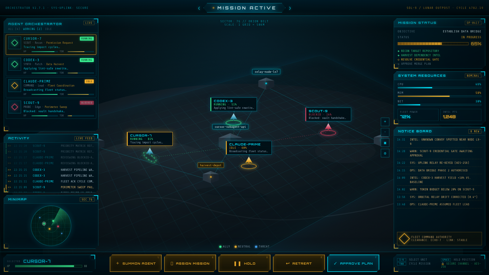

# ◆ AGENT FLEET COMMAND ◆

> **Your coding agents, deployed as a holographic strike fleet.** This is a real-time strategy command board for AI agents, with cyan/amber HUD, scanlines, radar sweep and all.



<sub>▲ **TACTICAL OVERVIEW.** Four units on station over Sector 7G. The roster is on the left, the sector map in the centre, mission telemetry on the right and the command bar at the bottom.</sub>


<sub>▲ **LIVE UPLINK ENGAGED.** CURSOR-7's status comes from the real cloud agent. The Notice Board shows the uplink and the activity feed logs `[LIVE IDLE]`.</sub>

---

## ▶ INCOMING TRANSMISSION

```
PRIORITY: ALPHA          CLEARANCE: ECHO-7          CHANNEL: SECURE

Commander,

Four agents are deployed across Sector 7G. One of them, CURSOR-7, is a
real cloud agent reporting over a live uplink. The others are simulated
wingmates running drills to keep the board alive.

Your orders: launch the board, watch the feed, keep the fleet unblocked.

                                        — FLEET COMMAND AUTHORITY
```

## ⚡ LAUNCH SEQUENCE

```bash
cd /workspace/agent-fleet-command
npm install
npm run dev
```

Open the URL Vite prints, usually **http://localhost:5173**. Best viewed at **1280×720 or larger**; the screenshots were captured at 1600×900.

No API keys, no backend, no secrets. Everything runs locally. The only external request is to Google Fonts for Orbitron and Share Tech Mono, and the board falls back to system fonts if you're offline.

## 🛰 WHAT YOU'RE LOOKING AT

An RTS-style agent management board in the AgentCraft mould (roster top-left, minimap bottom-left, mission banner top-centre, map everywhere else), restyled as a space-opera holographic HUD.

| Station | Where | What it does |
|---|---|---|
| **Mission Banner** | Top | `MISSION ACTIVE` chevron, orchestrator / uplink readout, sector and cycle |
| **Agent Orchestrator** | Left | Roster cards with RUNNING / IDLE / BLOCKED pills, class, role, mission, live activity, HP and token bars |
| **Activity** | Left, under roster | `>>` timestamped live log that ticks every ~2.6s |
| **Minimap** | Bottom-left | Circular radar with a rotating sweep and unit blips |
| **Tactical Map** | Everywhere else | Perspective terrain with craters and a cyan grid, block structures with blinking lights, animated data links, ships with selection rings and floating labels, a legend and map tool buttons |
| **Mission Status** | Right | Objective, an amber progress bar starting at 62% and an objectives checklist |
| **System Resources** | Right | Fluctuating CPU / MEM / NET bars, fleet power and intel points |
| **Notice Board** | Right | Live uplink card, alerts and the authority badge |
| **Command Bar** | Bottom | Selected unit HP and **SUMMON AGENT · ASSIGN MISSION · HOLD · RETREAT · APPROVE PLAN** |

**Controls:** click a roster card or a ship to select it, or press `1`–`4`. The command buttons are **stubs** for now. They show an `ACK` toast and don't send any orders yet.

Over all of it sits a CRT scanline layer with a faint flicker, plus notched panels with cyan/amber corner brackets.

### The fleet

| Unit | Mission | Disposition |
|---|---|---|
| **CURSOR-7** | Live cloud agent (see below) | Whatever the uplink says |
| **CODEX-3** | Data Harvest | Simulated: RUNNING / IDLE |
| **CLAUDE-PRIME** | Fleet Coordination | Simulated: IDLE / RUNNING |
| **SCOUT-9** | Perimeter Sweep | Simulated: mostly BLOCKED (someone get it its credentials) |

The simulated units cycle activity lines and status via `src/hooks/useActivityTicker.ts`. Their data lives in `src/data/mockAgents.ts`.

## 📡 LIVE UPLINK: CURSOR-7

CURSOR-7 isn't a drill. It's wired to the Cursor cloud agent
[`bc-da944dc0-9bd4-5ff1-8af9-0341f425d71f`](https://cursor.com/agents/bc-da944dc0-9bd4-5ff1-8af9-0341f425d71f).

**How the signal travels:** the browser **never** calls the cloud-agent API. It just reads `public/cursor-live.json` every 2 seconds. Something outside the browser pushes status into that file: you, a script, or Grok Bot using its own tools.

```
 Grok Bot / you / any script
        │ push
        ▼
 .cursor-bridge/status.json ──(cursor:watch, every 3s)──▶ public/cursor-live.json ──(poll 2s)──▶ HUD
        ▲                                                         ▲
        └──────────── POST /api/cursor-live (dev/preview, loopback) ┘
```

When an update lands:
- The roster card, map ship, minimap blip and selected-unit box all change status.
- `title` becomes the mission and `summary` becomes the activity line.
- The activity feed logs a `[LIVE <STATE>]` line, and the mock CURSOR-7 chatter goes quiet.
- The Notice Board **LIVE UPLINK** card shows the state, a clickable agent URL and when it last updated. The selected-unit box gets **OPEN AGENT ↗**.
- If the file goes missing or is malformed, the board keeps the last good values and the card reads **STALE** or **OFFLINE**.

**State translation** (`src/hooks/useCursorLive.ts`):

| Uplink says | Board shows |
|---|---|
| CREATING, PENDING, QUEUED, STARTING, RUNNING, IN_PROGRESS, ACTIVE, WORKING | 🟢 **RUNNING** |
| FAILED, ERROR, ERRORED, BLOCKED, CANCELLED/CANCELED, EXPIRED, TIMEOUT, NEEDS_INPUT, AWAITING_APPROVAL | 🔴 **BLOCKED** |
| FINISHED, COMPLETED, DONE, SUCCEEDED, STOPPED, anything else | 🟡 **IDLE** |

### Transmitting a status update

```bash
# Push helper: writes the bridge file and the live file
npm run cursor:push -- --state RUNNING --summary "Refactoring auth"
node scripts/write-cursor-status.mjs FINISHED "PR opened"            # state, then summary
CURSOR_STATE=FAILED CURSOR_SUMMARY="Build broke" node scripts/write-cursor-status.mjs

# Bridge file only (cursor:watch relays it within ~3s)
npm run cursor:push -- --target bridge --state FAILED --summary "Tests red"

# Over HTTP while `npm run dev` (or `npm run preview`) is up, from this machine only
curl -X POST http://127.0.0.1:5173/api/cursor-live \
  -H 'Content-Type: application/json' -d '{"state":"FINISHED","summary":"PR opened"}'
curl http://127.0.0.1:5173/api/cursor-live          # read current status
```

**Push options:** `--state`, `--summary`, `--title`, `--id`, `--url`, `--name`, or the env vars `CURSOR_STATE`, `CURSOR_SUMMARY`, `CURSOR_TITLE`, `CURSOR_AGENT_ID`, `CURSOR_AGENT_URL`, `CURSOR_NAME`. Flags beat positional arguments, which beat env vars, which beat the previous value. Choose where to write with `--target public|bridge|both` (default `both`, env `CURSOR_LIVE_TARGET`). Writes are atomic and always refresh `updatedAt`.

### Keeping the relay running

```bash
nohup npm run cursor:watch > /tmp/cursor-watch.log 2>&1 &
```

Every tick, the watcher uses the first source that applies:
1. **`CURSOR_STATUS_CMD`**: any shell command that prints JSON, for when a CLI or local API shows up.
2. **The bridge file**: `CURSOR_BRIDGE_PATH` or `AGENT_STATUS_PATH`, otherwise `.cursor-bridge/status.json`.
3. **`/tmp/cursor-agent-status.json`**.

The input format is loose. It accepts `state` or `status`, `summary`, `activity` or `message`, `title` or `mission`, `id`, `url`, or the same fields nested under `agent`. The watcher only writes when something actually changes, and it also updates `dist/cursor-live.json` if a build exists. Options: `--once`, `--interval <sec>` (env `CURSOR_SYNC_INTERVAL`), `--quiet`.

Vite ignores `.cursor-bridge/` and `public/cursor-live.json`, so status updates never reload the page.

## 🎛 COMMAND REFERENCE

| Command | Orders |
|---|---|
| `npm run dev` | Start the Vite dev server, including the `/api/cursor-live` endpoint |
| `npm run build` | Type-check (`tsc -b`) and production build into `dist/` |
| `npm run preview` | Serve the production build (the endpoint is available here too) |
| `npm run lint` | Lint with oxlint |
| `npm run cursor:push` | Push a CURSOR-7 status update |
| `npm run cursor:status` | Alias of `cursor:push` |
| `npm run cursor:watch` | Relay bridge → live file every 3s, forever |
| `npm run cursor:sync` | Relay once and exit |

## 🗺 SHIP SCHEMATICS

```
src/
  App.tsx                     layout + live CURSOR-7 merge
  components/                 MissionBanner, AgentList, ActivityFeed, Map, Minimap,
                              MissionStatus, ResourcePanel, NoticeBoard, CommandBar
  hooks/useActivityTicker.ts  simulated fleet chatter
  hooks/useCursorLive.ts      polls /cursor-live.json + state mapping
  data/mockAgents.ts          mock units, activity lines, feed events
plugins/cursorLiveApi.ts      Vite middleware: GET/POST /api/cursor-live
scripts/
  write-cursor-status.mjs     cursor:push / cursor:status
  auto-sync-cursor.mjs        cursor:watch / cursor:sync
  lib/cursor-live.mjs         shared normalise + atomic write
public/
  cursor-live.json            the live uplink file the HUD polls
  textures/terrain.svg        map backdrop
```

**Stack:** Vite · React 19 · TypeScript. Hand-rolled CSS, no UI kit.

## 📸 RECON PHOTOGRAPHY

To refresh the screenshot (with the dev server running):

```bash
google-chrome --headless=new --no-sandbox --hide-scrollbars --window-size=1600,900 \
  --virtual-time-budget=9000 --screenshot=demo-screenshot.png http://127.0.0.1:5173/
```

---

<sub>FLEET COMMAND AUTHORITY · CLEARANCE ECHO-7 · LINK STABLE · An original space-opera theme: no franchise names, logos or characters. Keep the fleet unblocked, Commander.</sub>
